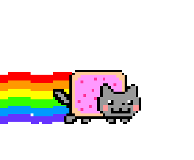

<h1 align="center">  Hi, I’m Zhengyang </h1>

##  About Me
- 🎓 MSc student at Imperial College London.
- 🤖 Learning and building with LLMs and AI agents.
- 🧠 Previously focused on machine learning and deep learning.
- 💼 Currently interning in London, UK.
- 💬 Welcome to ask me anything.
- 📫 Reach me at [zhengyang.li.pro@outlook.com](mailto:zhengyang.li.pro@outlook.com).

---

  

